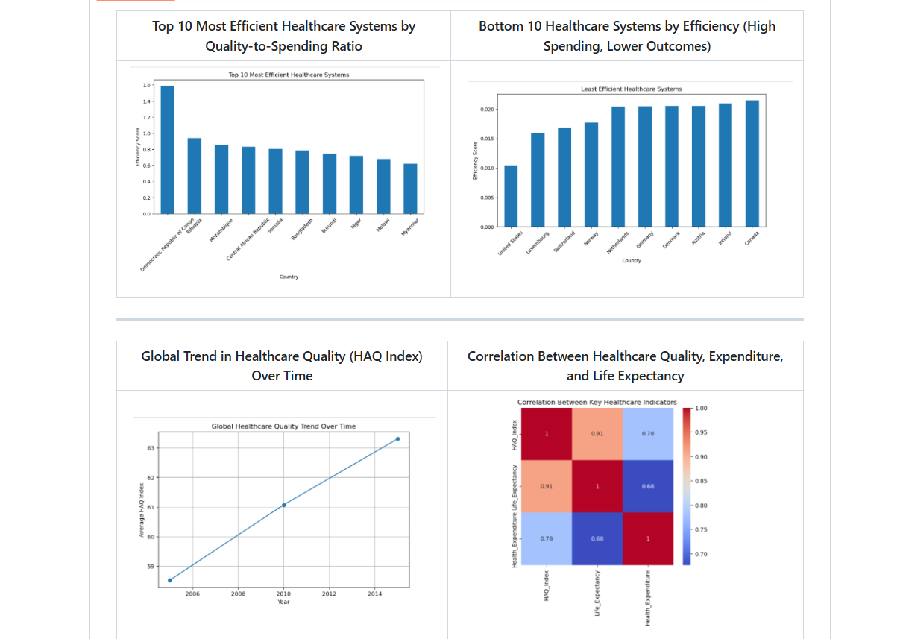
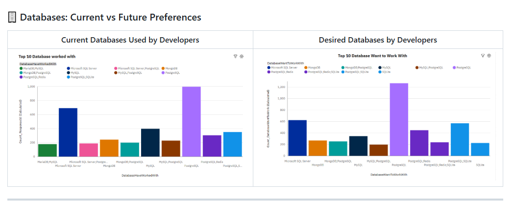
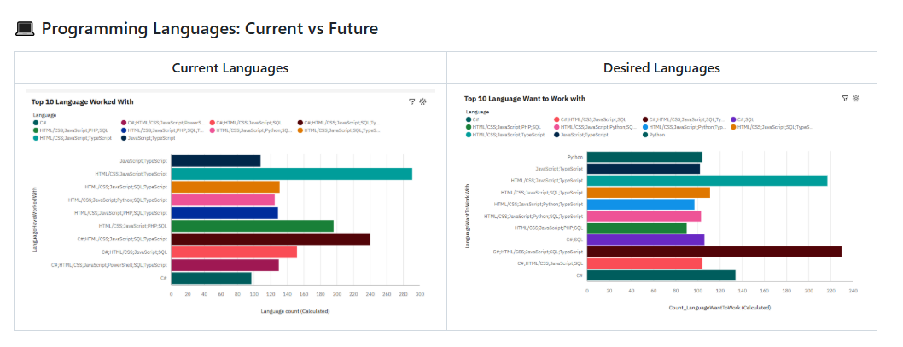

# 👋 Bulus Umoru  
### Data Analyst | Turning Data into Business Insights  

📍 Potsdam, Germany  
🔗 [LinkedIn](https://linkedin.com/in/bulus-umoru)  
<!--📄 [Download CV](https://etuk123456.github.io/portfolio1/docs/Profile.pdf)-->

---

## 🚀 About Me

I am a Data Analyst with a strong focus on transforming data into actionable insights that support business decisions.

I specialize in data analysis, dashboard development, and extracting meaningful patterns from data to solve real-world problems. My work combines analytical thinking with practical tools to deliver clear, impactful results.

---

## 🛠 Tech Stack

---

## 🔍 Core Competencies

- Data Analysis & Exploration  
- Data Cleaning & Transformation  
- Data Visualization & Dashboard Development  
- KPI Tracking & Performance Analysis  
- SQL Querying & Data Extraction  
- Python (pandas, numpy) for Data Analysis  
- Business Insight Generation  

---

# 📊 Featured Projects

---

## 🚀 1. Sales Performance Dashboard  
**Tools:** Power BI, Excel  

### 📌 Overview  
Interactive dashboard analyzing sales performance across customers, regions, and products to support business decision-making.

### 📊 Key Insights  
- Identified top-performing regions and revenue drivers  
- Highlighted customer contribution patterns  
- Revealed opportunities for improving low-performing segments  

👉 <a href="https://github.com/umorubulus/Sales-Performance-Dashboard-PowerBI" target="_blank">
    <b>🔗 View Full Dashboard Project</b>
  </a>

---

## 🏥 2. Healthcare Facility Performance & Patient Satisfaction Analysis
**Tools:** Python, SQL  

### 🔍 Overview  
This project analyzes global healthcare performance using publicly available datasets to evaluate **patient satisfaction (proxy), healthcare quality, and system efficiency** across countries.

The analysis integrates multiple data sources and applies data cleaning, transformation, and visualization techniques to uncover key insights into healthcare outcomes and operational performance.

---

### 🎯 Objectives  
- Evaluate healthcare system performance across countries  
- Analyze relationships between healthcare quality, expenditure, and outcomes  
- Identify efficient and inefficient healthcare systems  
- Translate complex healthcare data into actionable insights  

---

### 🛠️ Tools & Technologies  
- Python (pandas, matplotlib, seaborn)  
- SQL (data querying & aggregation)  
- Excel (dashboard & reporting)  
- PowerPoint (executive presentation) 
---
### 🔑 Key Insights  
- Healthcare quality strongly influences life expectancy  
- Increased healthcare spending improves outcomes, but not linearly  
- Some countries achieve high efficiency with optimized resource use  
- Global healthcare systems have improved over time, but disparities remain
  
  

👉 <a href="https://github.com/umorubulus/Healthcare-Facility-Performance-and-Patient-Satisfaction-Analysis" target="_blank">
    <b>🔗 View Full Project</b>
  </a>

  ---
## 📊 3. Global Developer Trends Analysis  
**Tools:**  Python (pandas, matplotlib), SQLite (data handling), IBM Cognos Analytics (Visualisation)

### 🔍 Overview  
This project presents an end-to-end analysis of global developer trends using survey data. It explores **technology adoption, compensation patterns, job satisfaction, and future skill preferences**, with insights delivered through Python-based analysis and an interactive **IBM Cognos Analytics dashboard**.

---
### 🔑 Key Findings  
1. Dominance of Modern Technologies  
  - PostgreSQL, JavaScript/TypeScript, and AWS dominate both current and future usage  
  - Indicates strong industry standardization around modern stacks  
2. Rising Demand for Data & AI Technologies  
  - Python shows significant growth in future preference  
  - Reflects shift toward:
    - Data science  
    - Machine learning  
    - Automation
  
3. Cloud Adoption is Strong and Growing  
  - AWS and Microsoft Azure lead platform usage  
  - Increasing interest in multi-cloud environments
  
4. Transition from Traditional to Modern Tools  
  - Technologies like SQL Server and PHP remain widely used  
  - But are less preferred for future learning

5. Growth of Polyglot Development  
  - Developers increasingly use multiple tools and technologies together  
  - Reflects real-world system complexity and specialization  

6. Developer Demographics Insight  
  - Majority of respondents fall within 25–34 age group  
  - Most hold Bachelor’s or Master’s degrees

    

     

👉 <a href="https://github.com/umorubulus/Global-Developer-Trends-Analysis" target="_blank">
    <b>🔗 View Full Project</b>
  </a>

  
## 🚀 4. Customer Segmentation Analysis  
**Tools:** Python, SQL  

### 📌 Overview  
Analyzed customer transaction data to segment customers based on value and behavior.

### 📊 Key Insights  
- Identified high-value and low-value customer groups  
- Enabled targeted marketing strategies  
- Improved understanding of purchasing behavior  

👉 <a href="https://github.com/umorubulus/Customer-Segmentation-Analysis" target="_blank">
    <b>🔗 View Full Project</b>
  </a>

---

## CONTACT DETAILS

*Let’s connect and see how we can make a difference together!*
<table>
  <tbody>
    <tr>
      <td>📧</td>
      <td><a href="mailto:umorubulus@fukashere.edu.ng">Email me</a></td>
    </tr>
    <tr>
      <td>📞</td>
      <td>(+49) 1511-1238-155</td>
    </tr>
    <tr>
      <td>📍</td>
      <td>Potsdam, Deutschland</td>
    </tr>
   <!-- <tr>
      <td>⬇️</td>
      <td><a href="https://etuk123456.github.io/portfolio1/docs/Profile.pdf">Download my CV</a></td>
    </tr>-->
    <tr>
      <td>🌐</td>
      <td><a href="https://linkedin.com/in/bulus-umoru">My LinkedIn Profile</a></td>
    </tr>
    
  </tbody>
</table>

   

